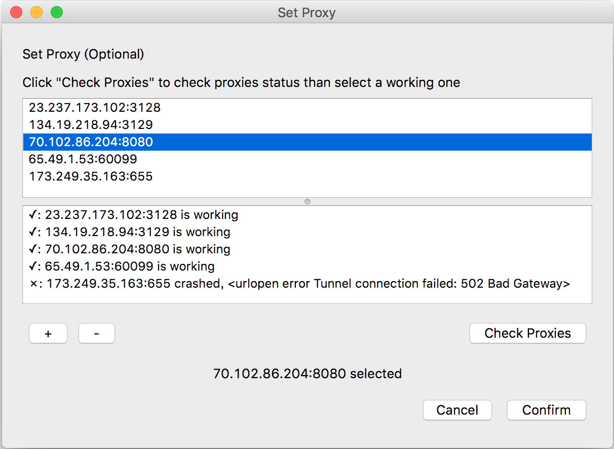
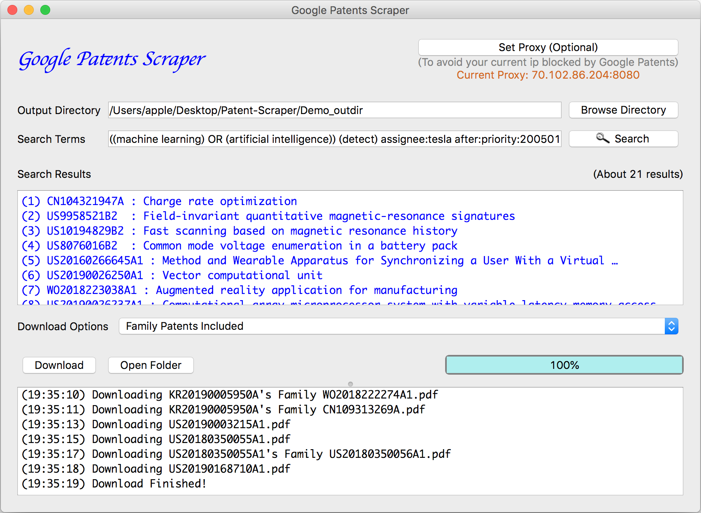

<p align="center">
  <a href=#>
    
  </a>
  <h2 align="center">Google Patents Scraper</h2>
    <div align="center">
  	(1) Automatically download all PDF files of searching results & their patent families.
  </div>
    <div align="center">
    (2) Generate an overview report of searching results.
  </div>
</p>


## Table of contents
* [Application Demo](#application-demo)
* [Introduction](#introduction)
* [Built With](#built-with)
* [Getting Started](#getting-started)
* [Acknowledgments](#acknowledgments)


## Application Demo
### [Google Patents Scraper – Demo (YouTube)](#)

## Introduction
This application scrape Google Patents by two steps:

* Set Proxy (Optional)
* Search & Download Patents

### Set Proxy (Optional)
* Set proxy to avoid current ip blocked by Google Patents

<p align="center">
    
</p>


### Search & Download Patents
* Select an output directory to store downloaded/generated files
* Key in search terms and search (search terms are the same as Google Patents)
* Download PDF files of searching results and their patent families (optional)
* PDF files and auto-generated report will be stored in selected directory

<p align="center">
    
</p>

### File Structure of Output Directory
<pre>
├── <a href="#">PDFs</a>
│   ├── CN104321947A.pdf
│   ├── ...
│   └── readme.txt
├── <a href="#">Family_PDFs</a>
│   ├── CN104321947A's\ Family
│   │   ├── EP2850716B1.pdf
│   │   ├── ...
│   │   └── readme.txt
│   ├── ...
│   └── ...
└── <a href="#">overview.md</a>
</pre>
* Output directory of demo located at [Demo_outdir](https://github.com/wenyalintw/Google-Patents-Scraper/tree/master/Demo_outdir)
* [overview.md](https://github.com/wenyalintw/Google-Patents-Scraper/blob/master/Demo_outdir/overview.md) represents the summary of completed searching

## Built With
Modules besides python built-ins

 * Web Scarping - [Selenium](https://www.seleniumhq.org/) / [Beautiful Soup](https://www.crummy.com/software/BeautifulSoup/) / [requests](https://2.python-requests.org//en/master/)
 * GUI framework - [PyQt5](https://pypi.org/project/PyQt5/)
 * Others - [fake-useragent](https://github.com/hellysmile/fake-useragent) / [tqdm](https://pypi.org/project/tqdm/)

## Getting Started
### Prerequisite
* Download [ChromeDriver](https://chromedriver.chromium.org/) corresponding with your Chrome version
* Replace the one in [src/resources](https://github.com/wenyalintw/Google-Patents-Scraper/tree/master/src/resources)

### Installation

* Clone the repo

```sh
git clone https://github.com/wenyalintw/Google-Patents-Scraper.git
```

* Install required modules listed in [requirements.txt](https://github.com/wenyalintw/Google-Patents-Scraper/blob/master/requirements.txt)

```sh
pip install -r /path/to/requirements.txt
```

* Ready to go!

```sh
cd src
python main.py
```


## Acknowledgments
- Checking process of proxies modified from [ApsOps's repo](https://github.com/ApsOps/proxy-checker/blob/master/proxy_check.py).
- [search.png](https://github.com/wenyalintw/Google-Patents-Scraper/blob/master/src/resources/iconfinder_search_461380.png) licensed under "CC BY 3.0" downloaded from [ICONFINDER](https://www.iconfinder.com/icons/1609653/brain_organs_icon).

